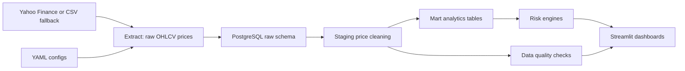

# Market Risk Analytics Platform

[](https://github.com/andrewikovic/market-risk-etl/actions/workflows/ci.yml)

This project is a market risk ETL and analytics platform built with Python, SQL, and Streamlit. It ingests multi-asset market data, normalizes raw prices into analytical tables, calculates portfolio returns and risk metrics, and displays results through an interactive dashboard.

The system calculates daily returns, rolling volatility, beta to benchmark, correlation matrices, historical/parametric/Monte Carlo VaR, Expected Shortfall, VaR backtesting, marginal and component VaR, asset-level risk contribution, factor exposures, portfolio optimization, drawdowns, stress-test losses, sector and asset-class exposures, currency-aware P&L, and P&L attribution.

## Project Overview

The platform models a realistic internal risk reporting workflow:

1. Extract adjusted close prices from Yahoo Finance or an offline CSV fallback.
2. Load raw market and portfolio inputs into PostgreSQL raw tables.
3. Clean prices into staging tables with quality flags.
4. Transform prices into returns, portfolio values, currency-aware position P&L, exposures, and risk metrics.
5. Calculate portfolio VaR, backtesting exceptions, contribution analytics, factor exposures, and optimized target weights.
6. Present risk, performance, attribution, and optimization views in Streamlit dashboards.

The default sample portfolio is a USD multi-asset ETF and equity portfolio with positions in SPY, AAPL, MSFT, GLD, and TLT. The dashboard works from bundled sample data, so it can be reviewed before any live API pull or PostgreSQL instance is configured.

## Architecture



## Repository Layout

```text
market-risk-etl/
  config/                 YAML asset, portfolio, and scenario configs
  data/sample/            Offline sample price history
  sql/                    PostgreSQL raw, staging, mart, and index DDL
  src/extract/            Price, benchmark, factor, and position extractors
  src/transform/          Price cleaning, returns, beta, P&L, exposure logic
  src/risk/               VaR, ES, covariance, stress, Monte Carlo engines
  src/load/               SQLAlchemy database utilities and loaders
  src/quality/            Data quality checks
  dashboards/             Streamlit app and dashboard pages
  Dockerfile              Container image for one-off and scheduled ETL runs
  docker-compose.yml      PostgreSQL plus optional scheduled ETL service
  tests/                  Pytest coverage for core analytics
```

## Data Model

The SQL model uses three PostgreSQL layers:

- `raw`: source-aligned market data, asset metadata, and portfolio positions.
- `staging`: cleaned daily adjusted close prices with `is_stale` and `is_missing` flags.
- `mart`: analytical facts for returns, portfolio values, position P&L, exposures, stress tests, Monte Carlo outputs, and data quality results.

Core marts include:

- `mart.daily_returns`
- `mart.portfolio_values`
- `mart.position_pnl`
- `mart.risk_metrics`
- `mart.exposures`
- `mart.var_backtest_exceptions`
- `mart.var_contributions`
- `mart.risk_contributions`
- `mart.factor_exposures`
- `mart.efficient_frontier`
- `mart.optimized_portfolio`
- `mart.rebalancing_trades`
- `mart.stress_test_results`
- `mart.monte_carlo_runs`
- `mart.monte_carlo_results`
- `mart.monte_carlo_terminal_values`
- `mart.data_quality_results`

## Using The Software

Prerequisites:

- Python 3.11 or newer.
- Docker and Docker Compose only if you want PostgreSQL or scheduled ETL.
- Internet access only if you want live Yahoo Finance data.

Set up the Python environment:

```bash
python3 -m venv .venv
.venv/bin/python -m pip install -r requirements.txt
```

Start the dashboard with bundled sample data:

```bash
.venv/bin/streamlit run dashboards/streamlit_app.py
```

Open the local Streamlit URL shown in the terminal. The app starts with sample CSV data, so no database or live market
data connection is required for first use. In the sidebar, use Data source to switch between Sample CSV, Live Yahoo
Finance, and PostgreSQL database. The selected data source and Yahoo history options persist while you move between
dashboard pages in the same Streamlit session.

To change the portfolio or assumptions, edit `config/portfolio.yml`, `config/assets.yml`, or `config/scenarios.yml`,
then rerun the pipeline or refresh the dashboard.

Run the ETL once and write processed CSV outputs:

```bash
.venv/bin/python -m src.pipeline
```

Use live Yahoo Finance data:

```bash
.venv/bin/python -m src.pipeline --live
```

Choose the historical Yahoo Finance window when needed:

```bash
.venv/bin/python -m src.pipeline --live --price-period max
.venv/bin/python -m src.pipeline --live --price-start 2020-01-01 --price-end 2026-01-01
.venv/bin/python -m src.pipeline --live --price-lookback-days 756
```

Load the warehouse into PostgreSQL:

```bash
cp .env.example .env
docker compose up -d postgres
.venv/bin/python -m src.pipeline --load-db
```

After loading PostgreSQL, start Streamlit and select PostgreSQL database in the dashboard sidebar.

Run the scheduled ETL service with Docker Compose:

```bash
cp .env.example .env
docker compose --profile scheduler up -d --build
docker compose logs -f etl-scheduler
```

Run the tests:

```bash
.venv/bin/python -m pytest -q
```

## ETL Pipeline

Run the local deterministic pipeline:

```bash
python3 -m venv .venv
.venv/bin/python -m pip install -r requirements.txt
.venv/bin/python -m src.pipeline
```

By default, `src.pipeline` writes processed CSV outputs under `data/processed/`. It does not load PostgreSQL unless
`--load-db` is provided.

Use live Yahoo Finance data before falling back to CSV:

```bash
.venv/bin/python -m src.pipeline --live
```

Unbounded live Yahoo Finance runs request the full available daily history (`period=max`) instead of yfinance's
short default period. You can bound or roll the history window explicitly:

```bash
.venv/bin/python -m src.pipeline --live --price-period max
.venv/bin/python -m src.pipeline --live --price-start 2020-01-01 --price-end 2026-01-01
.venv/bin/python -m src.pipeline --live --price-lookback-days 756
```

`--price-end` is exclusive, matching yfinance semantics. `--price-period` accepts yfinance daily periods such as
`1y`, `5y`, `10y`, `ytd`, and `max`, and cannot be combined with `--price-start`, `--price-end`, or
`--price-lookback-days`.

Require live Yahoo Finance data and fail if yfinance cannot return usable prices:

```bash
.venv/bin/python -m src.pipeline --require-live
```

Start PostgreSQL with Docker Compose:

```bash
cp .env.example .env
docker compose up -d postgres
```

This is a one-command Postgres container startup, not a complete warehouse load. The SQL files are applied by the
Python loader, not automatically by the Postgres container.

Initialize the schemas and load raw, staging, and mart tables:

```bash
.venv/bin/python -m src.pipeline --load-db
```

The database URL is read from `DATABASE_URL`. Use `--database-url` to override it for a single run. By default,
`--load-db` initializes the schemas and replaces the project-owned raw, staging, and mart rows so local reruns are
deterministic.

The current database setup is therefore two commands in practice:

```bash
docker compose up -d postgres
.venv/bin/python -m src.pipeline --load-db
```

Query the loaded warehouse:

```bash
docker exec -it market-risk-postgres psql -U risk_user -d market_risk
```

```sql
SELECT COUNT(*) FROM raw.prices;
SELECT * FROM mart.portfolio_values ORDER BY value_date DESC LIMIT 5;
SELECT * FROM mart.risk_metrics ORDER BY metric_date DESC, metric_name;
SELECT * FROM mart.var_backtest_exceptions ORDER BY backtest_date DESC, confidence_level LIMIT 10;
SELECT * FROM mart.var_contributions ORDER BY metric_date DESC, confidence_level, ticker;
SELECT * FROM mart.optimized_portfolio ORDER BY run_date DESC, ticker;
```

### Scheduled ETL Refresh

Run the scheduler locally from the virtual environment:

```bash
ETL_RUN_ON_START=true \
ETL_DAILY_AT=06:00 \
ETL_TIMEZONE=America/Edmonton \
ETL_LOAD_DB=true \
ETL_LIVE=true \
ETL_PRICE_PERIOD=max \
ETL_NO_WRITE=true \
.venv/bin/python -m src.scheduler
```

`ETL_DAILY_AT` runs the ETL once per day at `HH:MM` in `ETL_TIMEZONE`. If `ETL_DAILY_AT` is unset, the scheduler
uses `ETL_INTERVAL_MINUTES` instead. `ETL_RUN_ON_START=true` performs an immediate refresh before waiting for the
next scheduled time. The scheduler also accepts `ETL_PRICE_START`, `ETL_PRICE_END`, `ETL_PRICE_LOOKBACK_DAYS`, and
`ETL_PRICE_PERIOD` with the same rules as the one-off pipeline flags.

Run PostgreSQL and the scheduled ETL service with Docker Compose:

```bash
cp .env.example .env
docker compose --profile scheduler up -d --build
docker compose logs -f etl-scheduler
```

The Compose scheduler waits for the Postgres health check, loads the warehouse through `src.pipeline --load-db`
semantics, and by default refreshes daily at 06:00 `America/Edmonton` after an immediate startup run.

For a host cron deployment, call the one-off pipeline command directly from cron:

```cron
0 6 * * 1-5 cd /path/to/market-risk-etl && .venv/bin/python -m src.pipeline --live --load-db --no-write >> /tmp/market-risk-etl.log 2>&1
```

## Risk Metrics

The analytics layer includes:

- Daily simple and log returns.
- Annualized rolling volatility.
- Sharpe and Sortino ratios.
- Beta, alpha, tracking error, information ratio, and rolling beta to benchmark.
- Correlation and covariance matrices.
- Historical VaR and Expected Shortfall from empirical returns.
- Parametric VaR using the normal approximation.
- VaR exception tracking and Kupiec proportion-of-failures backtesting.
- Marginal and component VaR by asset, with contribution reconciliation.
- Asset-level volatility and VaR risk contribution using covariance.
- Correlated multi-asset Monte Carlo simulation using Cholesky decomposition.
- Multi-currency valuation with injected FX rates and explicit missing-rate errors.
- Factor exposure estimation from asset and factor return regressions.
- Efficient frontier generation, constrained optimization, and rebalance trades.
- Current and maximum drawdowns with worst-period detection.
- Asset-class, sector, ticker, currency, and country exposures.
- Position-level P&L and contribution to portfolio return.
- Scenario stress testing with ticker shocks overriding sector shocks, and sector shocks overriding asset-class shocks.

The one-off pipeline and dashboard both compute these analytics. When `--load-db` is used, the same outputs are
persisted to PostgreSQL marts and read back by the dashboard when the Data source sidebar control is set to
PostgreSQL database.

### Advanced Analytics Examples

VaR backtesting accepts dated realized P&L and either a scalar or dated VaR series:

```python
from src.risk.backtesting import generate_exception_report

report = generate_exception_report(
    realized_pnl=portfolio_values.set_index("value_date")["daily_pnl"],
    var_estimates=125_000,
    confidence_level=0.99,
)
```

Component VaR and risk contribution use aligned asset returns plus portfolio weights:

```python
from src.risk.parametric_var import calculate_component_var
from src.risk.risk_contribution import calculate_asset_risk_contributions

component_var = calculate_component_var(returns, weights, portfolio_value=latest_value, confidence_level=0.975)
risk_contribution = calculate_asset_risk_contributions(returns, weights, portfolio_value=latest_value)
```

Currency conversion is optional and uses the portfolio `base_currency` when present. Provide FX rates as a DataFrame
with `rate_date`, `from_currency`, `to_currency`, and `rate`, or inject an object with `get_rate(from_currency,
to_currency, rate_date)`. Missing non-base rates raise `MissingFXRateError`.

```python
from src.transform.calculate_pnl import calculate_portfolio_values

portfolio_values, position_pnl = calculate_portfolio_values(positions, prices, fx_rates=fx_rates)
```

Factor exposures are estimated with ordinary least squares over overlapping asset and factor return dates:

```python
from src.risk.factor_model import estimate_factor_exposures

factor_model = estimate_factor_exposures(asset_returns, factor_returns, weights=weights)
asset_betas = factor_model["asset_exposures"]
portfolio_betas = factor_model["portfolio_factor_exposure"]
```

Portfolio optimization supports long-only, fully invested portfolios with min/max weights and optional target return
or target volatility:

```python
from src.risk.optimization import calculate_rebalancing_trades, generate_efficient_frontier, optimize_portfolio

frontier = generate_efficient_frontier(expected_returns, covariance_matrix, points=25, max_weight=0.40)
target = optimize_portfolio(expected_returns, covariance_matrix, max_weight=0.40, target_return=0.08)
trades = calculate_rebalancing_trades(current_weights, target["weights"], portfolio_value=latest_value)
```

### Pipeline Output Keys

`run_pipeline(write_processed=False)` returns DataFrames for the advanced analytics under these keys:

- `var_backtest`
- `var_contributions`
- `risk_contributions`
- `factor_exposures`
- `efficient_frontier`
- `optimized_portfolio`
- `rebalancing_trades`

When processed CSV writing is enabled, these frames are written to `data/processed/` alongside the existing prices,
returns, portfolio values, P&L, exposures, and quality outputs.

## Dashboard

Start Streamlit:

```bash
.venv/bin/streamlit run dashboards/streamlit_app.py
```

By default, Streamlit uses bundled sample data. Use the dashboard sidebar Data source control to switch between bundled sample CSV data, live Yahoo Finance data, and PostgreSQL-backed marts after running `--load-db`.

The selected data source persists while you move between dashboard pages in the same Streamlit session, so changing
from Sample CSV to Live Yahoo Finance or PostgreSQL does not reset when you open another page.

When Live Yahoo Finance is selected, the sidebar also shows Yahoo history controls. These controls only affect live
Yahoo Finance dashboard loads; sample CSV and PostgreSQL dashboard modes use their existing data as-is.

The selected Yahoo history mode and its input values also persist across page switches.

Yahoo history options:

- Full history: requests the full available daily history from yfinance using `period=max`.
- Period: sends a yfinance period such as `10y`, `5y`, `1y`, `ytd`, or `3mo`.
- Date range: sends an inclusive start date and an exclusive end date, matching yfinance's `start` and `end` semantics.
- Rolling lookback: fetches the last N calendar days of history ending today.

For risk metrics, longer lookbacks usually produce more stable covariance, VaR, Expected Shortfall, and drawdown
estimates. Shorter lookbacks can be useful for recent market regimes, but may make the analytics more sensitive to a
small number of recent observations.

Set `MARKET_DATA_MODE=sample`, `MARKET_DATA_MODE=live`, or `MARKET_DATA_MODE=database` before starting Streamlit if you want to choose the initial sidebar selection.

Pages:

- Market Overview
- Portfolio Overview
- Risk Summary
- VaR and Expected Shortfall
- Monte Carlo Simulation
- Stress Testing
- Exposure Analytics
- P&L Attribution
- Data Quality
- VaR Backtesting
- Risk Contributions
- Factor Model
- Portfolio Optimization

The advanced pages are backed by the same pipeline outputs in all dashboard modes:

- VaR Backtesting shows exception history, breach severity, Kupiec statistic, p-value, and pass/fail status.
- Risk Contributions shows marginal VaR, component VaR, contribution percentages, volatility contribution, and reconciliation checks.
- Factor Model shows asset betas, portfolio factor exposure, residual volatility, idiosyncratic variance, and R-squared.
- Portfolio Optimization shows the efficient frontier, optimized target weights, constraint diagnostics, and rebalance trades.

## Dashboard Screenshots

Screenshot image files are not checked in yet. After running Streamlit locally, capture and save:

```text
docs/screenshots/market_overview.png
docs/screenshots/portfolio_overview.png
docs/screenshots/risk_summary.png
docs/screenshots/monte_carlo.png
```

## Sample Portfolio

```yaml
portfolio_name: "Sample Multi-Asset Portfolio"
base_currency: "USD"
initial_value: 100000
positions:
  - ticker: "SPY"
    asset_class: "Equity"
    sector: "Broad Market"
    currency: "USD"
    quantity: 150
  - ticker: "AAPL"
    asset_class: "Equity"
    sector: "Technology"
    currency: "USD"
    quantity: 80
  - ticker: "MSFT"
    asset_class: "Equity"
    sector: "Technology"
    currency: "USD"
    quantity: 60
  - ticker: "GLD"
    asset_class: "Commodity"
    sector: "Gold"
    currency: "USD"
    quantity: 100
  - ticker: "TLT"
    asset_class: "Fixed Income"
    sector: "Treasury Bonds"
    currency: "USD"
    quantity: 120
```

## Sample Outputs

The offline sample pipeline currently produces:

```text
Price rows: 125
Return rows: 120
Portfolio dates: 25
```

Example risk metrics are available from:

```python
from src.pipeline import run_pipeline

outputs = run_pipeline(write_processed=False)
outputs["risk_metrics"]
```

## Tests

Run the test suite:

```bash
.venv/bin/python -m pytest -q
```

## Continuous Integration

GitHub Actions runs the test suite on pull requests and on pushes to `main`. The `CI` workflow uses Ubuntu, Python 3.12, pip dependency caching, installs `requirements.txt`, and runs:

```bash
python -m pytest -q
```

Coverage includes returns, rolling volatility, beta alignment, drawdowns, VaR, Expected Shortfall, stress testing, exposures, Monte Carlo reproducibility, simulated correlations, and data quality checks.
Coverage also includes VaR backtesting, component VaR reconciliation, asset-level risk contributions, multi-currency valuation, factor regression against known synthetic loadings, constrained optimization, rebalancing trades, and pipeline output integration for the dashboard/database analytics.

## Known Limitations

- The model uses historical market data and assumes the future resembles the past.
- Monte Carlo simulations use normally distributed returns unless otherwise specified.
- Covariance estimates may be unstable for short lookback windows.
- Yahoo Finance or public market data may contain missing or adjusted values.
- Stress scenarios are manually defined and do not represent full macroeconomic models.
- Transaction costs, taxes, dividends, and liquidity constraints are not fully modeled.

## Future Improvements

The original portfolio-demo roadmap items for PostgreSQL, end-to-end mart loads, scheduled ETL, dashboard data-source
switching, Yahoo history controls, VaR backtesting, VaR contribution analytics, risk contribution, factor regression,
portfolio optimization, and multi-currency valuation are implemented.

Remaining production-oriented TODOs:

- ETL observability: add retry/backoff for live pulls, structured failure logging, raw-pull audit rows, and email/Slack/webhook alerts for failed scheduled runs.
- Report export: add dashboard download actions for selected risk tables and a generated PDF/CSV risk pack with portfolio summary, VaR/ES, stress tests, exposures, and backtesting results.
- Factor data configuration: let `src.pipeline` read external factor-return sources from config or CLI flags, validate factor coverage, and fall back clearly to built-in proxy factors when no source is configured.
- Optimization realism: add transaction costs, lot-size rounding, turnover limits, tax/dividend assumptions, and liquidity caps to target weights and rebalancing trades.
- Live FX ingestion: fetch historical FX rates for non-base-currency assets, persist raw FX rates, and feed those rates into P&L, exposure, and valuation calculations.
- Hosted dashboard security: add authentication and access-control guidance for deployed Streamlit environments.
- Deployment engineering: add cloud deployment examples, environment-specific config, and secrets-management guidance.
- Screenshots: capture current dashboard pages and check in image files under `docs/screenshots/`.

## Resume Bullet

Built a Python, SQL, and Streamlit market-risk ETL platform that ingests multi-asset market data, normalizes raw price feeds into analytical marts, and calculates returns, rolling volatility, beta, historical/parametric/Monte Carlo VaR, Expected Shortfall, VaR backtests, component VaR, asset risk contribution, factor exposures, portfolio optimization, stress-test losses, currency-aware exposures, and P&L attribution.
