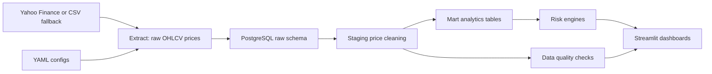

# Market Risk Analytics Platform

This project is a market risk ETL and analytics platform built with Python, SQL, and Streamlit. It ingests multi-asset market data, normalizes raw prices into analytical tables, calculates portfolio returns and risk metrics, and displays results through an interactive dashboard.

The system calculates daily returns, rolling volatility, beta to benchmark, correlation matrices, historical/parametric/Monte Carlo VaR, Expected Shortfall, drawdowns, stress-test losses, sector and asset-class exposures, and P&L attribution.

## Project Overview

The platform models a realistic internal risk reporting workflow:

1. Extract adjusted close prices from Yahoo Finance or an offline CSV fallback.
2. Load raw market and portfolio inputs into PostgreSQL raw tables.
3. Clean prices into staging tables with quality flags.
4. Transform prices into returns, portfolio values, position P&L, exposures, and risk metrics.
5. Present risk and performance views in Streamlit dashboards.

The default sample portfolio is a USD multi-asset ETF and equity portfolio with positions in SPY, AAPL, MSFT, GLD, and TLT. The dashboard works from bundled sample data, so it can be reviewed before any live API pull or PostgreSQL instance is configured.

## Architecture



## Repository Layout

```text
market-risk-etl/
  config/                 YAML asset, portfolio, and scenario configs
  data/sample/            Offline sample price history
  sql/                    PostgreSQL raw, staging, mart, and index DDL
  src/extract/            Price, benchmark, factor, and position extractors
  src/transform/          Price cleaning, returns, beta, P&L, exposure logic
  src/risk/               VaR, ES, covariance, stress, Monte Carlo engines
  src/load/               SQLAlchemy database utilities and loaders
  src/quality/            Data quality checks
  dashboards/             Streamlit app and dashboard pages
  Dockerfile              Container image for one-off and scheduled ETL runs
  docker-compose.yml      PostgreSQL plus optional scheduled ETL service
  tests/                  Pytest coverage for core analytics
```

## Data Model

The SQL model uses three PostgreSQL layers:

- `raw`: source-aligned market data, asset metadata, and portfolio positions.
- `staging`: cleaned daily adjusted close prices with `is_stale` and `is_missing` flags.
- `mart`: analytical facts for returns, portfolio values, position P&L, exposures, stress tests, Monte Carlo outputs, and data quality results.

Core marts include:

- `mart.daily_returns`
- `mart.portfolio_values`
- `mart.position_pnl`
- `mart.risk_metrics`
- `mart.exposures`
- `mart.stress_test_results`
- `mart.monte_carlo_runs`
- `mart.monte_carlo_results`
- `mart.data_quality_results`

## ETL Pipeline

Run the local deterministic pipeline:

```bash
python3 -m venv .venv
.venv/bin/python -m pip install -r requirements.txt
.venv/bin/python -m src.pipeline
```

By default, `src.pipeline` writes processed CSV outputs under `data/processed/`. It does not load PostgreSQL unless
`--load-db` is provided.

Use live Yahoo Finance data before falling back to CSV:

```bash
.venv/bin/python -m src.pipeline --live
```

Require live Yahoo Finance data and fail if yfinance cannot return usable prices:

```bash
.venv/bin/python -m src.pipeline --require-live
```

Start PostgreSQL with Docker Compose:

```bash
cp .env.example .env
docker compose up -d postgres
```

This is a one-command Postgres container startup, not a complete warehouse load. The SQL files are applied by the
Python loader, not automatically by the Postgres container.

Initialize the schemas and load raw, staging, and mart tables:

```bash
.venv/bin/python -m src.pipeline --load-db
```

The database URL is read from `DATABASE_URL`. Use `--database-url` to override it for a single run. By default,
`--load-db` initializes the schemas and replaces the project-owned raw, staging, and mart rows so local reruns are
deterministic.

The current database setup is therefore two commands in practice:

```bash
docker compose up -d postgres
.venv/bin/python -m src.pipeline --load-db
```

Query the loaded warehouse:

```bash
docker exec -it market-risk-postgres psql -U risk_user -d market_risk
```

```sql
SELECT COUNT(*) FROM raw.prices;
SELECT * FROM mart.portfolio_values ORDER BY value_date DESC LIMIT 5;
SELECT * FROM mart.risk_metrics ORDER BY metric_date DESC, metric_name;
```

### Scheduled ETL Refresh

Run the scheduler locally from the virtual environment:

```bash
ETL_RUN_ON_START=true \
ETL_DAILY_AT=06:00 \
ETL_TIMEZONE=America/Edmonton \
ETL_LOAD_DB=true \
ETL_LIVE=true \
ETL_NO_WRITE=true \
.venv/bin/python -m src.scheduler
```

`ETL_DAILY_AT` runs the ETL once per day at `HH:MM` in `ETL_TIMEZONE`. If `ETL_DAILY_AT` is unset, the scheduler
uses `ETL_INTERVAL_MINUTES` instead. `ETL_RUN_ON_START=true` performs an immediate refresh before waiting for the
next scheduled time.

Run PostgreSQL and the scheduled ETL service with Docker Compose:

```bash
cp .env.example .env
docker compose --profile scheduler up -d --build
docker compose logs -f etl-scheduler
```

The Compose scheduler waits for the Postgres health check, loads the warehouse through `src.pipeline --load-db`
semantics, and by default refreshes daily at 06:00 `America/Edmonton` after an immediate startup run.

For a host cron deployment, call the one-off pipeline command directly from cron:

```cron
0 6 * * 1-5 cd /path/to/market-risk-etl && .venv/bin/python -m src.pipeline --live --load-db --no-write >> /tmp/market-risk-etl.log 2>&1
```

## Risk Metrics

The analytics layer includes:

- Daily simple and log returns.
- Annualized rolling volatility.
- Sharpe and Sortino ratios.
- Beta, alpha, tracking error, information ratio, and rolling beta to benchmark.
- Correlation and covariance matrices.
- Historical VaR and Expected Shortfall from empirical returns.
- Parametric VaR using the normal approximation.
- Correlated multi-asset Monte Carlo simulation using Cholesky decomposition.
- Current and maximum drawdowns with worst-period detection.
- Asset-class, sector, ticker, currency, and country exposures.
- Position-level P&L and contribution to portfolio return.
- Scenario stress testing with ticker shocks overriding sector shocks, and sector shocks overriding asset-class shocks.

## Dashboard

Start Streamlit:

```bash
.venv/bin/streamlit run dashboards/streamlit_app.py
```

By default, Streamlit uses bundled sample data. Use the dashboard sidebar Data source control to switch between bundled sample CSV data, live Yahoo Finance data, and PostgreSQL-backed marts after running `--load-db`.

Set `MARKET_DATA_MODE=sample`, `MARKET_DATA_MODE=live`, or `MARKET_DATA_MODE=database` before starting Streamlit if you want to choose the initial sidebar selection.

Pages:

- Market Overview
- Portfolio Overview
- Risk Summary
- VaR and Expected Shortfall
- Monte Carlo Simulation
- Stress Testing
- Exposure Analytics
- P&L Attribution
- Data Quality

## Dashboard Screenshots

Add screenshots after running Streamlit locally:

```text
docs/screenshots/market_overview.png
docs/screenshots/portfolio_overview.png
docs/screenshots/risk_summary.png
docs/screenshots/monte_carlo.png
```

## Sample Portfolio

```yaml
portfolio_name: "Sample Multi-Asset Portfolio"
base_currency: "USD"
initial_value: 100000
positions:
  - ticker: "SPY"
    asset_class: "Equity"
    sector: "Broad Market"
    currency: "USD"
    quantity: 150
  - ticker: "AAPL"
    asset_class: "Equity"
    sector: "Technology"
    currency: "USD"
    quantity: 80
  - ticker: "MSFT"
    asset_class: "Equity"
    sector: "Technology"
    currency: "USD"
    quantity: 60
  - ticker: "GLD"
    asset_class: "Commodity"
    sector: "Gold"
    currency: "USD"
    quantity: 100
  - ticker: "TLT"
    asset_class: "Fixed Income"
    sector: "Treasury Bonds"
    currency: "USD"
    quantity: 120
```

## Sample Outputs

The offline sample pipeline currently produces:

```text
Price rows: 125
Return rows: 120
Portfolio dates: 25
```

Example risk metrics are available from:

```python
from src.pipeline import run_pipeline

outputs = run_pipeline(write_processed=False)
outputs["risk_metrics"]
```

## Tests

Run the test suite:

```bash
.venv/bin/python -m pytest -q
```

Coverage includes returns, rolling volatility, beta alignment, drawdowns, VaR, Expected Shortfall, stress testing, exposures, Monte Carlo reproducibility, simulated correlations, and data quality checks.

## Known Limitations

- The model uses historical market data and assumes the future resembles the past.
- Monte Carlo simulations use normally distributed returns unless otherwise specified.
- Covariance estimates may be unstable for short lookback windows.
- Yahoo Finance or public market data may contain missing or adjusted values.
- Stress scenarios are manually defined and do not represent full macroeconomic models.
- Transaction costs, taxes, dividends, and liquidity constraints are not fully modeled.

## Future Improvements

- One-command full database bootstrap that starts Postgres, waits for health, and runs `src.pipeline --load-db`
- Scheduled ETL failure notifications and backfill controls
- Exportable PDF/CSV risk report
- Factor model
- Risk contribution by asset
- Marginal VaR
- Component VaR
- VaR backtesting
- Currency conversion
- Portfolio rebalancing
- Efficient frontier
- Optimization

## Resume Bullet

Built a Python, SQL, and Streamlit market-risk ETL platform that ingests multi-asset market data, normalizes raw price feeds into analytical marts, and calculates daily returns, rolling volatility, beta, correlation matrices, historical/parametric/Monte Carlo VaR, Expected Shortfall, drawdowns, stress-test losses, sector and asset-class exposures, and P&L attribution.
