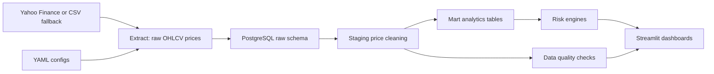

# Market Risk Analytics Platform

This project is a market risk ETL and analytics platform built with Python, SQL, and Streamlit. It ingests multi-asset market data, normalizes raw prices into analytical tables, calculates portfolio returns and risk metrics, and displays results through an interactive dashboard.

The system calculates daily returns, rolling volatility, beta to benchmark, correlation matrices, historical/parametric/Monte Carlo VaR, Expected Shortfall, drawdowns, stress-test losses, sector and asset-class exposures, and P&L attribution.

## Project Overview

The platform models a realistic internal risk reporting workflow:

1. Extract adjusted close prices from Yahoo Finance or an offline CSV fallback.
2. Load raw market and portfolio inputs into PostgreSQL raw tables.
3. Clean prices into staging tables with quality flags.
4. Transform prices into returns, portfolio values, position P&L, exposures, and risk metrics.
5. Present risk and performance views in Streamlit dashboards.

The default sample portfolio is a USD multi-asset ETF and equity portfolio with positions in SPY, AAPL, MSFT, GLD, and TLT. The dashboard works from bundled sample data, so it can be reviewed before any live API pull or PostgreSQL instance is configured.

## Architecture



## Repository Layout

```text
market-risk-etl/
  config/                 YAML asset, portfolio, and scenario configs
  data/sample/            Offline sample price history
  sql/                    PostgreSQL raw, staging, mart, and index DDL
  src/extract/            Price, benchmark, factor, and position extractors
  src/transform/          Price cleaning, returns, beta, P&L, exposure logic
  src/risk/               VaR, ES, covariance, stress, Monte Carlo engines
  src/load/               SQLAlchemy database utilities and loaders
  src/quality/            Data quality checks
  dashboards/             Streamlit app and dashboard pages
  tests/                  Pytest coverage for core analytics
```

## Data Model

The SQL model uses three PostgreSQL layers:

- `raw`: source-aligned market data, asset metadata, and portfolio positions.
- `staging`: cleaned daily adjusted close prices with `is_stale` and `is_missing` flags.
- `mart`: analytical facts for returns, portfolio values, position P&L, exposures, stress tests, Monte Carlo outputs, and data quality results.

Core marts include:

- `mart.daily_returns`
- `mart.portfolio_values`
- `mart.position_pnl`
- `mart.risk_metrics`
- `mart.exposures`
- `mart.stress_test_results`
- `mart.monte_carlo_runs`
- `mart.monte_carlo_results`
- `mart.data_quality_results`

## ETL Pipeline

Run the local deterministic pipeline:

```bash
python3 -m venv .venv
.venv/bin/python -m pip install -r requirements.txt
.venv/bin/python -m src.pipeline
```

Use live Yahoo Finance data before falling back to CSV:

```bash
.venv/bin/python -m src.pipeline --live
```

Require live Yahoo Finance data and fail if yfinance cannot return usable prices:

```bash
.venv/bin/python -m src.pipeline --require-live
```

Initialize PostgreSQL schemas:

```python
from src.load.db import get_engine, initialize_database

engine = get_engine()
initialize_database(engine, "sql")
```

The database URL is read from `DATABASE_URL`. Copy `.env.example` to `.env` and update it for your local PostgreSQL instance.

## Risk Metrics

The analytics layer includes:

- Daily simple and log returns.
- Annualized rolling volatility.
- Sharpe and Sortino ratios.
- Beta, alpha, tracking error, information ratio, and rolling beta to benchmark.
- Correlation and covariance matrices.
- Historical VaR and Expected Shortfall from empirical returns.
- Parametric VaR using the normal approximation.
- Correlated multi-asset Monte Carlo simulation using Cholesky decomposition.
- Current and maximum drawdowns with worst-period detection.
- Asset-class, sector, ticker, currency, and country exposures.
- Position-level P&L and contribution to portfolio return.
- Scenario stress testing with ticker shocks overriding sector shocks, and sector shocks overriding asset-class shocks.

## Dashboard

Start Streamlit:

```bash
.venv/bin/streamlit run dashboards/streamlit_app.py
```

By default, Streamlit uses bundled sample data. To use yfinance in the dashboard, start Streamlit with:

```bash
MARKET_DATA_MODE=live .venv/bin/streamlit run dashboards/streamlit_app.py
```

Use `MARKET_DATA_MODE=live_with_fallback` if you want the dashboard to try yfinance first and fall back to sample data when a live pull fails.

Pages:

- Market Overview
- Portfolio Overview
- Risk Summary
- VaR and Expected Shortfall
- Monte Carlo Simulation
- Stress Testing
- Exposure Analytics
- P&L Attribution
- Data Quality

## Dashboard Screenshots

Add screenshots after running Streamlit locally:

```text
docs/screenshots/market_overview.png
docs/screenshots/portfolio_overview.png
docs/screenshots/risk_summary.png
docs/screenshots/monte_carlo.png
```

## Sample Portfolio

```yaml
portfolio_name: "Sample Multi-Asset Portfolio"
base_currency: "USD"
initial_value: 100000
positions:
  - ticker: "SPY"
    asset_class: "Equity"
    sector: "Broad Market"
    currency: "USD"
    quantity: 150
  - ticker: "AAPL"
    asset_class: "Equity"
    sector: "Technology"
    currency: "USD"
    quantity: 80
  - ticker: "MSFT"
    asset_class: "Equity"
    sector: "Technology"
    currency: "USD"
    quantity: 60
  - ticker: "GLD"
    asset_class: "Commodity"
    sector: "Gold"
    currency: "USD"
    quantity: 100
  - ticker: "TLT"
    asset_class: "Fixed Income"
    sector: "Treasury Bonds"
    currency: "USD"
    quantity: 120
```

## Sample Outputs

The offline sample pipeline currently produces:

```text
Price rows: 125
Return rows: 120
Portfolio dates: 25
```

Example risk metrics are available from:

```python
from src.pipeline import run_pipeline

outputs = run_pipeline(write_processed=False)
outputs["risk_metrics"]
```

## Tests

Run the test suite:

```bash
.venv/bin/python -m pytest -q
```

Coverage includes returns, rolling volatility, beta alignment, drawdowns, VaR, Expected Shortfall, stress testing, exposures, Monte Carlo reproducibility, simulated correlations, and data quality checks.

## Known Limitations

- The model uses historical market data and assumes the future resembles the past.
- Monte Carlo simulations use normally distributed returns unless otherwise specified.
- Covariance estimates may be unstable for short lookback windows.
- Yahoo Finance or public market data may contain missing or adjusted values.
- Stress scenarios are manually defined and do not represent full macroeconomic models.
- Transaction costs, taxes, dividends, and liquidity constraints are not fully modeled.

## Future Improvements

- Docker Compose with Postgres
- Scheduled ETL runs
- Exportable PDF/CSV risk report
- Factor model
- Risk contribution by asset
- Marginal VaR
- Component VaR
- VaR backtesting
- Currency conversion
- Portfolio rebalancing
- Efficient frontier
- Optimization

## Resume Bullet

Built a Python, SQL, and Streamlit market-risk ETL platform that ingests multi-asset market data, normalizes raw price feeds into analytical marts, and calculates daily returns, rolling volatility, beta, correlation matrices, historical/parametric/Monte Carlo VaR, Expected Shortfall, drawdowns, stress-test losses, sector and asset-class exposures, and P&L attribution.
